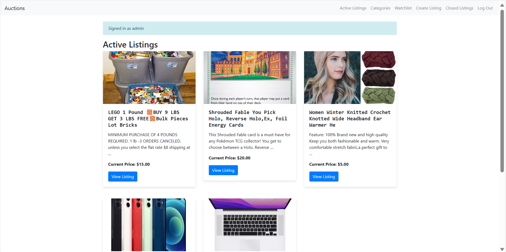

# Commerce

## Description
This project is a web application built using the Django framework. Django is a high-level Python web framework that encourages rapid development and clean, pragmatic design. It is used to handle the backend logic, database interactions, and server-side processing for this project.

## Features
- User authentication and authorization
- Database management with Django ORM
- Dynamic HTML rendering with Django templates
- Static file handling
- Form handling and validation
- URL routing and request handling

## Installation
1. Clone the repository:
    ```bash
    git clone https://github.com/ngxvu/commerce.git
    cd commerce
    ```

2. Create a virtual environment and activate it:
    ```bash
    python -m venv venv
    source venv/bin/activate  # On Windows use `venv\Scripts\activate`
    ```

3. Install the required packages:
    ```bash
    pip install -r requirements.txt
    ```

4. Apply migrations:
    ```bash
    python manage.py migrate
    ```

5. Run the development server:
    ```bash
    python manage.py runserver
    ```

## Usage
1. Open your web browser and navigate to `http://127.0.0.1:8000/`.
2. Register a new user or log in with existing credentials.
3. Explore the features of the web application.

## Django Framework
Django is used in this project to:
- **Handle HTTP requests and responses**: Django's URL dispatcher maps URLs to views, which process requests and return responses.
- **Manage the database**: Django ORM (Object-Relational Mapping) allows for easy database interactions without writing raw SQL.
- **Render HTML templates**: Django's template engine dynamically generates HTML pages based on the data passed from views.
- **Handle static files**: Django manages static files like CSS, JavaScript, and images.
- **Form handling and validation**: Django simplifies form creation, validation, and processing.

## Contributing
1. Fork the repository.
2. Create a new branch (`git checkout -b feature-branch`).
3. Make your changes and commit them (`git commit -m 'Add new feature'`).
4. Push to the branch (`git push origin feature-branch`).
5. Open a pull request.

## License
This project is licensed under the MIT License. See the `LICENSE` file for more details.